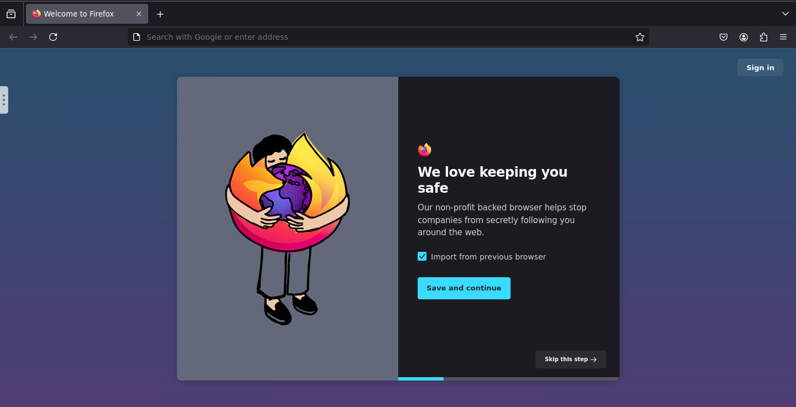

# Containerize WebBrowser
* This will create Firefox web browser inside docker container


### How to use
* Windows double-check run.bat
* Linux use run.sh
```sh
sudo ./run.sh
```
* Docker Compose 
```sh
mkdir ./config
docker-compose up -d
```